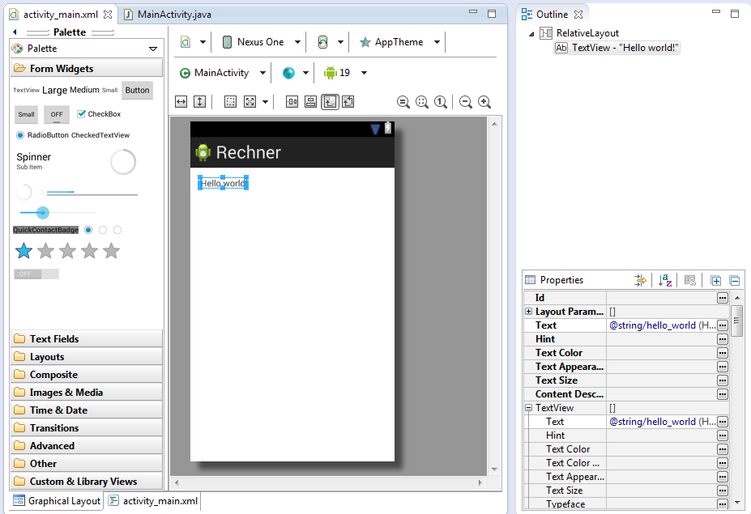
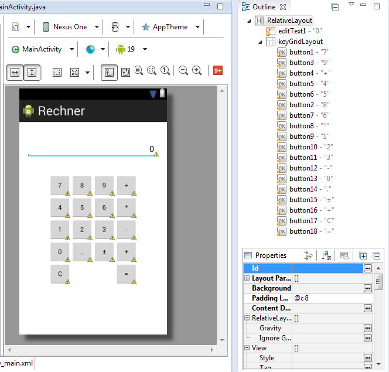
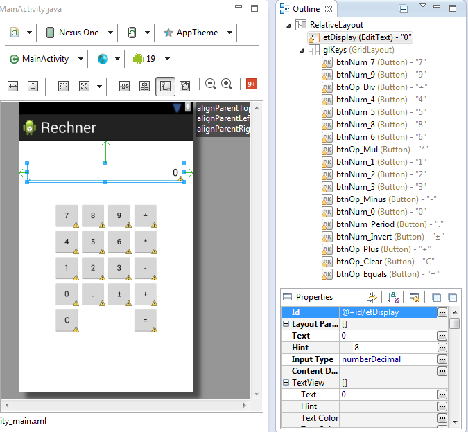
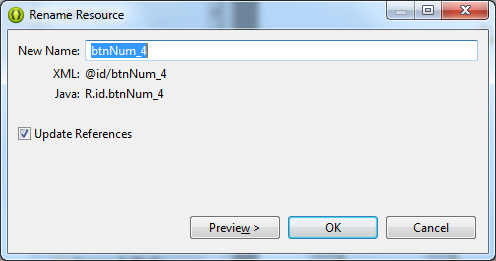

# 6. Rechner

Mittels der bisher erlangten Kenntnisse ist es nun möglich, ein erstes Projekt zu realisieren.  

Dies wird ein simpler Rechner nach Werbegeschenk-Art sein.  
Und zwar von der Sparkasse, weswegen es auch wichtig sein wird, negative Zahlen einzugeben.  
Von unsereins Minus lebt schließlich die Sparkasse.

**Hilfestellung**

Mittels des _Graphical Layout_ soll zunächst das Rechner-Layout erschaffen werden.

Dazu ist zunächst ein Ziffern-Block 

- mit den Tasten 0-9
- mit einer Dezimal-Punkt-Taste	(.)	
- mit einer Vorzeichen-Wechsel-Taste (±)

zu erstellen.  

Desweiteren sind mathematische Operations-Tasten zum

- Addieren (+)
- Subtrahieren (-)
- Multiplizieren (*)
- Dividieren (÷)

notwendig.

Letztendlich kommen noch jeweils 

- eine Lösch-Taste (C)
- Ergebnis-Taste (=)

hinzu.

Fangen wir an.

Zunächst ein neues Android-Projekt erstellen.  
Dann diese 'Hello world!'-TextView löschen.



Nun auf der linken Seite 'Layouts' öffnen.  
Dort auf das 'GridLayout' klicken, festhalten und auf die Oberfläche ziehen.

Nun in die **activity_main.xml** wechseln.  
Dann die beiden letzten Zeilen mit 'columnCount' und 'rowCount' einbringen.  

Normalerweise, normalerweise sollte dies per 'Properties'-Editor möglich sein.  
Ich habe es nicht geschafft, die gewünschten Zahlenwerte wurden einfach nicht übernommen.

```xml
    <GridLayout
		.
		.
        android:columnCount="4"
        android:rowCount="5" >

	</GridLayout>
```
Als nächstes wurden aus 'Form Widgets' Buttons vom Typ 'Small' in das 'GridLayout' übernommen.  
Dies kann durchaus zur Fummelei werden, bis man die Buttons in die richtige Position gebracht hat. Zum Teil möchten diese ausserhalb des 'GridLayout's einrasten.  
Hilfreich ist dabei, stets einen Blick auf die 'Outline' rechts neben dem Haupt-Fenster zu werfen, ob der Button auch im 'GridLayout' angekommen ist und nicht außerhalb dessen zur Ablage gelangte.  

Zum Schluß ist über dem 'GridLayout' eine 'EditText' einzubringen.
Ihr findet diese unter 'TextFields'. Runter-Scrollen bis zu 'Number (Decimal)'.  Dies ist dann das Richtige.  

Die geometrische Anordnung der Steuerelemente ist nun abgeschlossen.      



Um nun die bereitgestellten Steuerelemente später __gezielt__ ansprechen zu können, sind diese __gezielt__ umzubenennen.  

Die Namenskonvention ist folgende :

- Tasten, welche auf Ziffern hindeuten, werden nach *btnNum_x* umbenannt
- die Dezimal-Punkt-Taste(.) nach *btnNum_Period* umbenennen 
- die Vorzeichen-Wechsel-Taste (±) nach *btnNum_Invert* umbenennen  
- die Taste Addieren(+) nach *btnOp_Plus* umbenennen
- die Taste Subtrahieren(-) nach *btnOp_Minus* umbenennen
- die Taste Multiplizieren(*) nach *btnOp_Mul* umbenennen
- die Taste Dividieren(÷) nach *btnOp_Div* umbenennen
- die Taste (C)lear nach *btnOp_Clear* umbenennen
- die Taste (=) nach *btnOp_Equals* umbenennen   

Das Ergebnis sollte so aussehen: 



Beim Umbenennen erscheint permanent dieser Dialog.  
Egal wie störend dieser wirkt, Schalter 'OK' betätigen und auf zur nächsten Anpassung.



Das grafische Layout ist nun abgeschlossen.
Zu einem nachfolgenden Zeitpunkt werden wir hierher zurückkehren und die Händler einhängen.  
Dies ist erfolgt jedoch erst im übernächste Schritt.
 